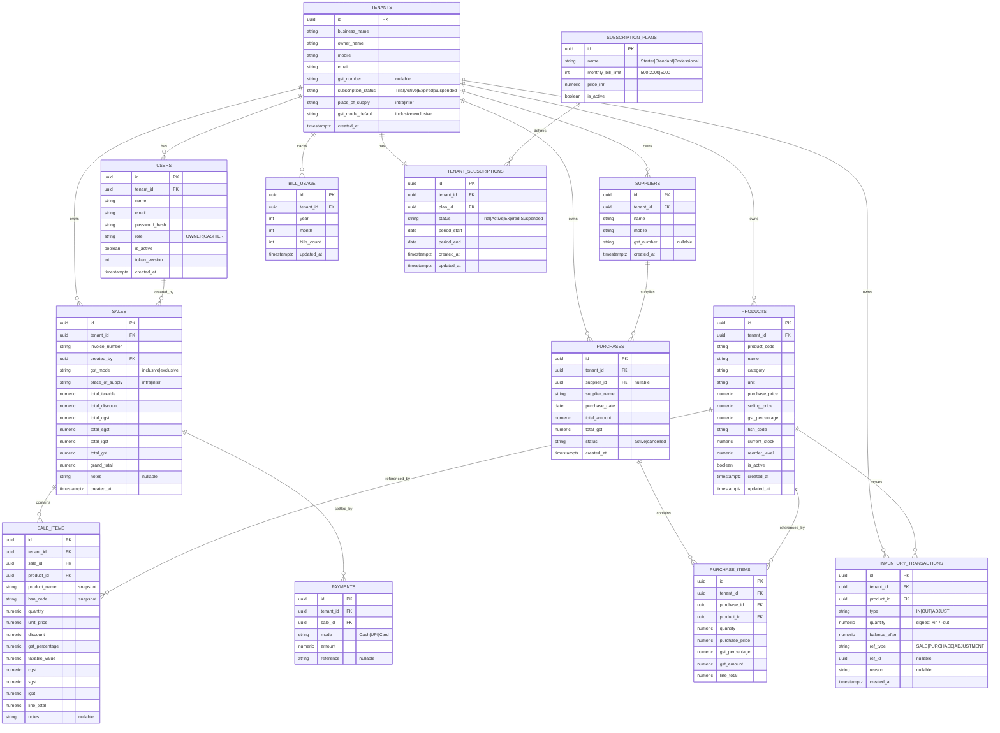

# 6. Database ER Diagram & Schema — BillNova Phase 1

PostgreSQL, shared-schema multi-tenancy. Every business table carries `tenant_id`. Money = `NUMERIC(12,2)`; quantities = `NUMERIC(12,3)`; timestamps = `TIMESTAMPTZ`.

## 6.1 ER Diagram (Mermaid)



## 6.2 Table Notes & Constraints

| Table | Key constraints / notes |
|-------|-------------------------|
| **tenants** | `email` unique. `subscription_status` mirrors the active `tenant_subscriptions.status` for quick reads. |
| **users** | Unique `(tenant_id, email)`. `token_version` bumped on logout/password-reset to invalidate refresh tokens. |
| **subscription_plans** | Seeded reference data: Starter/Standard/Professional with limits 500/2000/5000. |
| **tenant_subscriptions** | One active row per tenant; `period_start/end` define the paid window; manual activation updates this. |
| **bill_usage** | Unique `(tenant_id, year, month)`; `bills_count` incremented atomically per saved sale. |
| **products** | Unique `(tenant_id, product_code)`. `current_stock` maintained from inventory transactions. Soft-delete via `is_active`. |
| **suppliers** | Optional master; purchases also store `supplier_name` snapshot for simplicity. |
| **purchases / purchase_items** | Saving writes IN transactions; cancel writes compensating movements. |
| **sales** | Unique `(tenant_id, invoice_number)`. Stores GST mode + place of supply used at sale time. |
| **sale_items** | Snapshots product_name/hsn for historical accuracy; per-line GST split stored. |
| **payments** | One row per mode; split = multiple rows; `SUM(amount) = sales.grand_total` enforced in service + check at write. |
| **inventory_transactions** | Append-only ledger; `quantity` signed; `balance_after` gives running balance; `ref_type/ref_id` links to source. |

## 6.3 Indexes

```text
users                  (tenant_id), unique (tenant_id, email)
products               (tenant_id), unique (tenant_id, product_code),
                       (tenant_id, name), (tenant_id, hsn_code), (tenant_id, is_active)
suppliers              (tenant_id)
purchases              (tenant_id, purchase_date)
purchase_items         (tenant_id, purchase_id), (tenant_id, product_id)
sales                  (tenant_id, created_at), unique (tenant_id, invoice_number)
sale_items             (tenant_id, sale_id), (tenant_id, product_id)
payments               (tenant_id, sale_id)
inventory_transactions (tenant_id, product_id, created_at)
bill_usage             unique (tenant_id, year, month)
tenant_subscriptions   (tenant_id)
```
Composite indexes lead with `tenant_id` so every tenant-scoped query is index-served.

## 6.4 Referential & Integrity Rules

- All FKs include `tenant_id` consistency (enforced in app layer; cross-tenant FKs impossible by construction).
- `NUMERIC` everywhere for money/quantity — no floating point.
- Atomic operations (bill save, purchase save, adjustments) run in a single DB transaction.
- Soft delete for products referenced by history; hard delete only for never-referenced rows.

## 6.5 Seed Data

- `subscription_plans`: Starter (500), Standard (2000), Professional (5000).
- Optional demo tenant + sample products for local dev (behind a seed script, not in prod migrations).
